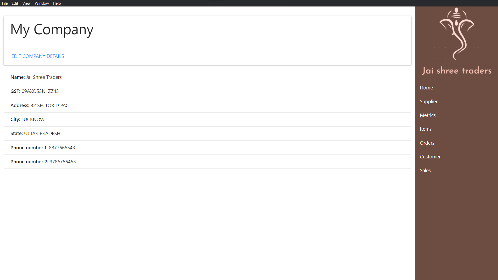
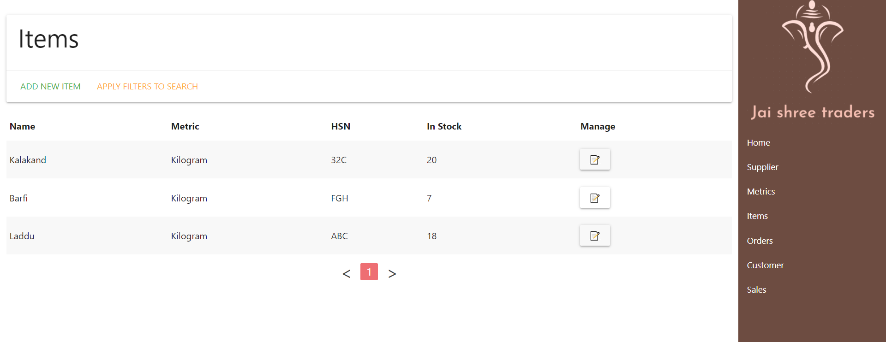
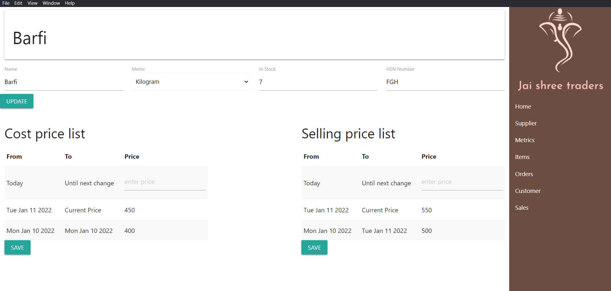
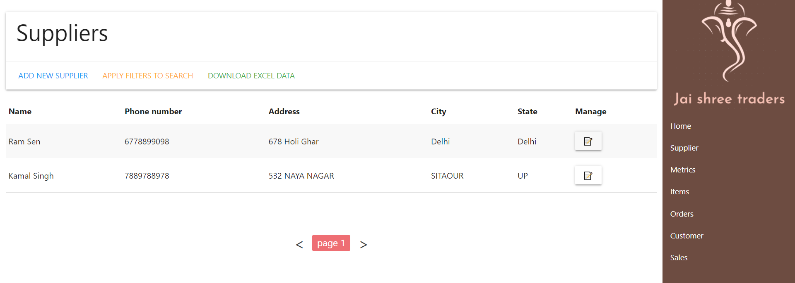
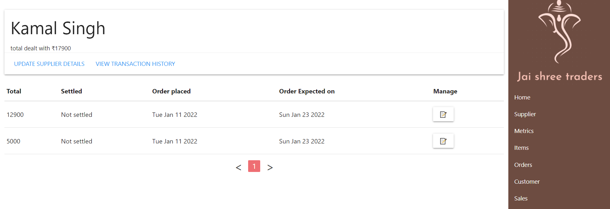
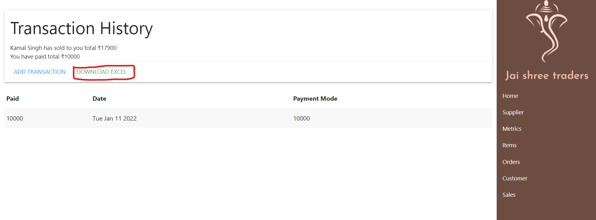
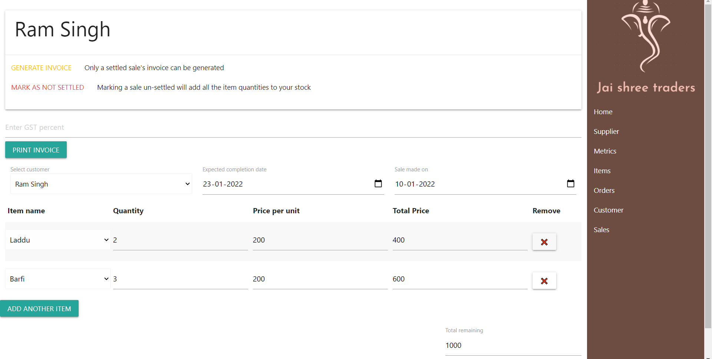
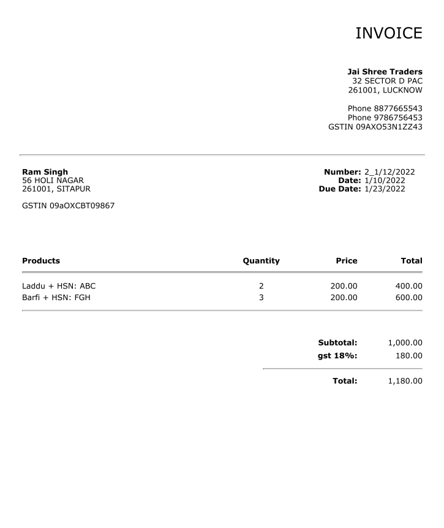
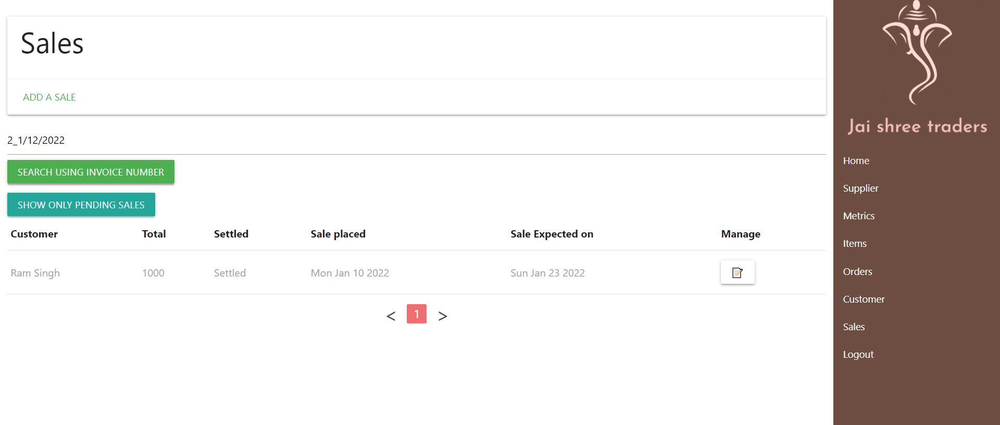

# This software is being actively used by shopowners.
# Introduction
A complete B2C Business software designed using Electron.
Following is the home page which houses the owner's company details which can be modified further and are shown on the invoice that is generated by the app.

## Items module.
The items module maintains a list of all the items you buy or sell.

The individual Item page also handles all the previous prices of the items present in your inventory, which you change. 
Any order you place, will pick the price from these lists, depending on whether you are buying or selling.

## Supplier Module
The suppliers module manages data of all the suppliers you deal with, and this list can be downloaded in Excel as well.

Each supplier's individual orders can be viewed like this.
.
And the transaction history to these suppliers can also be managed like this. All the previous transactions can be exported in Excel as well.

The order's page can be updated and settled. Settling an order, will 

## Customer Module.
The role of customer is opposite to supplier, as the customers will buy the product. The module is similar to supplier, and instead of orders, customers will have sales.
The customer module also has all the features which are present in supplier module. But since the customer is buying from us, we will also be providing them with invoicesm by using the following invoice button and entering the GST percentage, which varies from product to product.

The invoice is generated in the form of a pdf and looks somewhat like this.

There is a unique identification number on the pdf, which can be later used to see which sale it corresponds to. As can be seen from the following image

## Instructions to run on your machine.
1. Make sure npm is installed on your system.
2. Run "npm install" in the root folder to install all the required packages.
3. Now run "npm run dist" which is a script that you will find in package.json file. It will create a folder named dist. Which will have the .exe file to run as a setup for your machine.

Software is password protected, initial password is 123456, which you can change later on. Since the password is stored on your local machine the password is not encrypted.